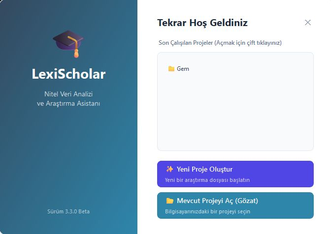
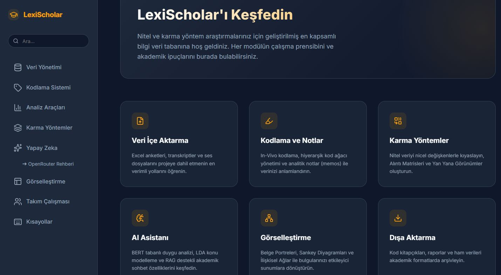
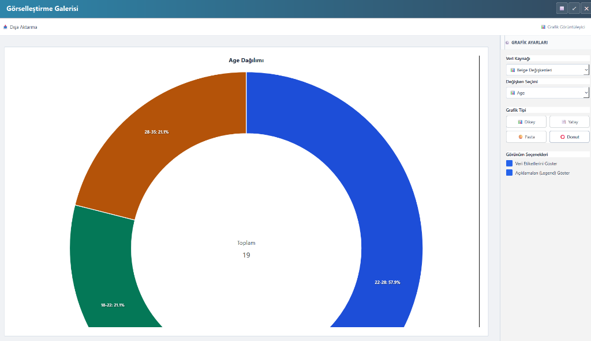
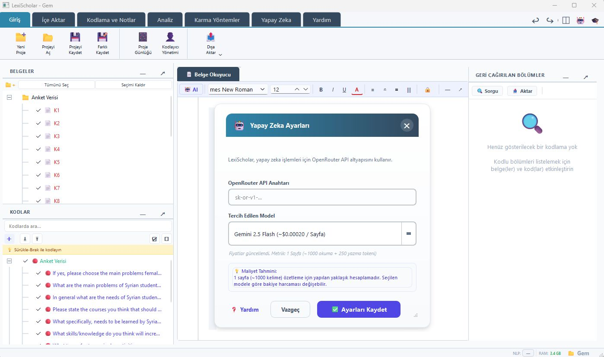

# 🏛️ LexiScholar v3.8 Beta

> *Özel, Yapay Zeka Destekli Nitel Veri Analizi Platformu.*

**Not:** Bu depo bir **Portfolyo Vitrini** olarak hizmet vermektedir. Tam kaynak kodu ve tescilli AI entegrasyon pipeline'ları fikri mülkiyeti korumak amacıyla gizli tutulmaktadır. Demo, iş birliği veya akademik kullanım talepleri için lütfen yazar ile iletişime geçin.

---

## 🎯 Vizyon ve Problem Tanımı

Akademik araştırmalarda Nitel Veri Analizi (QDA); yüksek lisans, doktora öğrencileri ve kıdemli araştırmacılar için binlerce saatlik manuel emekten oluşmaktadır. MAXQDA ve NVivo gibi geleneksel masaüstü yazılımları iki büyük soruna sahiptir:

1.  **Gizlilik ve Etik:** Mülakat verilerinin ticari bulut sunucularına yüklenmesi GDPR uyumluluğunu zorlaştırır.
2.  **Erişilebilirlik:** Lisans maliyetleri ciddi finansal külfet yaratır.

**LexiScholar**, NLP'yi **%100 yerel bilgisayarda (Offline)** çalıştırarak veri gizliliğinden taviz vermeyen modern bir QDA platformudur.

---

## ✨ Temel Özellikler

| Özellik | Açıklama |
|---|---|
| 🎙️ **Whisper Transkripsiyon** | Bulut kullanmadan ses/video kayıtlarını %98 doğrulukla deşifre eder |
| 🤖 **AI Kodlama & Özetleme** | OpenRouter LLM ile kod önerisi, metin özeti ve çeviri |
| 💬 **Belgeyle AI Sohbet** | Seçilen bir belgeyle doğrudan sohbet edebilme (RAG benzeri akış) |
| 🎓 **Bilgi Ansiklopedisi** | Programın her özelliğini detaylıca açıklayan premium, web tabanlı rehber sistemi |
| ✍️ **Parafraze** | Kodlanmış segmentleri araştırmacının kendi sözcükleriyle özetleme |
| 🌌 **Anlamsal Haritalama** | BGE-M3 modeli ile metinleri çok boyutlu uzayda kümeleme ve haritalama |
| 📊 **Dinamik Görselleştirmeler** | Sankey diyagramı, belge portresi, kelime bulutu, kod bulutu |
| 👥 **Çoklu Kodlayıcı / IRR** | Cohen's Kappa ile kodlayıcı güvenilirliği ölçümü |
| ↩️ **Undo/Redo Sistemi** | Command Pattern — kodlama ve parafraze işlemleri geri alınabilir |
| 🔍 **FTS5 Tam Metin Arama** | SQLite FTS5 ile tüm belge içeriğinde anlık arama |
| 🌙 **Modern Arayüz** | Kullanıcı dostu ve hızlı tepki veren tasarım |
| 🗃️ **Çok Format Desteği** | PDF, DOCX, XLSX, ODS, RTF, TXT, MP3, MP4 ve daha fazı |

---

## 🚀 v3.8 Beta — Yenilikler (Mart 2026)

### 🛡️ Kapsamlı Güvenlik ve Kararlılık Denetimi (Audit)
- **Veritabanı İşlem Güvenliği:** `get_db_connection` üzerinde tam rollback desteği ve Thread-safe olmayan bağlantı yönetimi iyileştirmeleri. Veritabanı kilitleme (locking) riskleri minimize edildi.
- **FTS5 Tam Metin Arama Senkronizasyonu:** Belgeler üzerinde yapılan her ekleme, güncelleme ve silme işlemini anlık olarak arama motoruna yansıtan SQL Trigger altyapısı kuruldu.
- **Export Katmanı Güvenliği:** HTML ve CSV çıktıları üzerinde CSS Injection ve Spreadsheet Formula Injection saldırılarına karşı sertifikalı validasyon kuralları eklendi.
- **NLP & LLM Kararlılığı:** NER (Varlık Tanıma) worker süreçlerine "Askıya Alma/İptal" desteği eklendi. LLM yanıtlarındaki JSON tespit algoritması bağlam-duyarlı hale getirilerek hatalı çıktı üretimi engellendi.

## 🚀 v3.7.0 — Yenilikler

### 🌌 Anlamsal Haritalama (Semantic Mapping)
- **BGE-M3 Entegrasyonu:** Tamamen yerel, çok dilli BAAI/bge-m3 modeli ile gömülü anlamsal temsil. (Internet gerektirmez)
- **Kümeleme Haritası:** Sınıfları ve segmentleri dinamik "Cluster Map" üzerinde çok boyutlu uzayda grafikleme. UMAP ve HDBSCAN algoritmaları ile akıllı gruplama.
- **Hızlı Anlamsal Arama:** Kodlu segmentlerde kelime (string) yerine "anlam" tabanlı semantik arama modu.

### 🎓 Akademik Araştırma Wiki Dönüşümü (v3.6)
- **Metodolojik Derinlik:** Yardım ansiklopedisi; Gömülü Kuram (Grounded Theory), Aksiyel Kodlama ve Triangülasyon gibi akademik kavramları içeren derin bir rehbere dönüştürüldü.
- **Akademik Dil:** Tüm içerikler akademik bir tonda yeniden yazıldı ve metodolojik uyarılar eklendi.
- **Akıllı Arama:** Bilgi bankası dizini; *Epistemoloji*, *Cohen's Kappa*, *Saturasyon* gibi 50+ akademik terimle zenginleştirildi.
- **Kesintisiz Geçiş:** Program içindeki yardım simgeleri, doğrudan ilgili metodolojik bölüme odaklanan derin bağlantılarla güncellendi.

### 🤖 Gelişmiş AI Analiz Katmanı
- **Senior Academic Persona:** Yapay zeka asistanları, "Kıdemli Akademik Hakem" kimliğiyle analiz yapacak şekilde optimize edildi.
- **AI Hakem Sistemi:** Farklı modellerin çıktılarını sentezleyen ve akademik tutarlılığı denetleyen yeni bir iş akışı eklendi.
- **Gelişmiş RAG:** Belge sohbetlerinde halüsinasyon riskini minimize eden geliştirilmiş bağlam yönetimi.

### 📊 Görselleştirme ve Raporlama
- **Sankey ve Semantik Haritalama:** Kod ilişkilerini görselleştiren modellerin grafik kütüphanesi v3.6 standartlarına yükseltildi.
- **Dinamik Filtreleme:** Gösterge (legend) ve veri etiketi (data labels) kontrolleri optimize edildi.

### 🧠 Akıllı Model Yönetimi (Smart Model Management)
- **Model Boyutu Raporlama:** İndirilecek yerel modellerin boyutları artık Hugging Face üzerinden anlık olarak çekilip kullanıcıya gösterilir.
- **Seçici Güncelleme:** Yaklaşık 10 GB tutan model kütüphanesinden sadece ihtiyaç duyulan modellerin (Duygu Analizi, NER veya BGE-M3) tekil olarak seçilip indirilmesine olanak tanıyan yeni "Model Bakım" arayüzü eklendi.
- **Verimli Depolama:** Kullanıcılar disk alanını yönetmek için istemedikleri modelleri pasif bırakabilir.

---

## 🛠️ Teknoloji Yığını

| Katman | Teknoloji |
|---|---|
| **Arayüz** | PyQt6 — Mixin tabanlı bileşen mimarisi |
| **Yapay Zeka** | PyTorch, HuggingFace Transformers, OpenAI Whisper, YAKE |
| **LLM** | OpenRouter API (GPT-4o, Gemini, Qwen…) |
| **Görselleştirme** | Plotly, Matplotlib, Pandas, NumPy, D3.js |
| **Veritabanı** | SQLite3 — DAO deseni, FTS5 arama, migration desteği |
| **Dökümantasyon** | HTML5, CSS3, JavaScript (Lucide Icons, Inter Fonts) |

> ⚠️ **Windows Sistem Bağımlılığı:** Yerel AI modellerinin çalışabilmesi için **Microsoft Visual C++ Redistributable (x64)** kurulu olmalıdır.

---

## 🏗️ Mimari Genel Bakış

```
LexiScholar v3.8 Beta
│
├── main.py                  # Giriş noktası, ortam kurulumu
├── __version__.py           # Merkezi versiyon bilgisi (v3.8 Beta)
├── nlp_engine.py            # NLP işlevleri (duygu, NER, KWIC, konu modeli)
├── llm_engine.py            # OpenRouter API wrapper
│
├── docs/                    # Dokümantasyon
│   └── encyclopedia/        # Bilgi Ansiklopedisi (HTML/CSS/JS)
│
├── database/                # DAO Katmanı
│   ├── connection.py        # FTS5 başlatma ve migration
│   ├── coder_dao.py         # Kodlayıcı (analist) yönetimi
│   └── ...
│
├── ui/                      # Arayüz Bileşenleri
│   ├── coded_segments_dialog.py  # Parafraze sütunu, sağ tık menüsü
│   ├── ai_settings_dialog.py    # Merkezi AI ayarları paneli
│   ├── irr_dialogs.py           # Analist uyumu (IRR) araçları
│   ├── variable_dialogs.py      # Veri editörü ve tablo araçları
│   ├── ribbon_setup.py          # Entegre yardım sistemi
│   └── ...
│
├── visualizations/          # Görselleştirme modülleri
└── tests/                   # pytest test paketi
```

---

## 🚀 Kurulum ve Çalıştırma

### Gereksinimler
- Python 3.11+
- Windows 10/11 (64-bit)
- Microsoft Visual C++ Redistributable (x64)
- NVIDIA GPU (opsiyonel, Whisper ve BERT model hızlandırma için)

### Bağımlılıkları Yükle
```bash
pip install -r requirements.txt
```

### Uygulamayı Başlat
```bash
python main.py
```

### Testleri Çalıştır
```bash
# UI accessibility smoke seti
pytest tests/test_ui_accessibility_smoke.py -m a11y -q

# Hızlı testler (model gerektirmez)
pytest tests/ -m "not slow and not a11y"

# Tüm testler (BERT, NER modelleri gerektirir — uzun sürer)
pytest tests/ -m slow
```

---

## 📁 Proje Dosya Yapısı

Her proje `.lxs` uzantılı bir dizin içinde saklanır:

```
proje_adi/
├── lexischolar.db          # SQLite veritabanı (belgeler, kodlar, segmentler, parafrazlar)
├── lexischolar.marker      # Proje imza dosyası
└── snapshots/              # Otomatik yedekler
```

---

## 🔐 Gizlilik & Güvenlik

- Tüm NLP modelleri **yerel olarak** çalışır; hiçbir akademik veri dışarı gönderilmez
- OpenRouter API yalnızca kullanıcının tercihiyle AI özet/sohbet özelliğinde devreye girer
- API anahtarı `.env` dosyasında saklanır — asla kaynak koda gömülmez
- Parametreli SQL sorguları kullanılır — SQL injection riski yoktur
- `python-dotenv` ile API anahtarı ortam değişkenlerinden güvenli okunur

---

## 🆚 QDA Araç Karşılaştırması

| 🆚 QDA Araç Karşılaştırması | MAXQDA | NVivo | LexiScholar |
|---|:---:|:---:|:---:|
| Fiyat | ~600 €/yıl | ~700 €/yıl | **Ücretsiz** |
| Parafraze | ✅ | ✅ | ✅ |
| Belgeyle AI Sohbet | ✅ | ❌ | ✅ |
| Anlamsal Kümeleme Haritası | ❌ | ❌ | ✅ |
| Takım Çalışması / Coder Management | ✅ | ✅ | **✅ (Bulut Dostu)** |
| Analist Uyumu (IRR) | ✅ | ✅ | **✅ (Cohen's Kappa)** |
| Veri Editörü (Spreadsheet) | ✅ | ✅ | ✅ |
| Yerel (offline) AI (Whisper) | ❌ | ❌ | ✅ |
| Ansiklopedi İçi Arama | ❌ | ❌ | ✅ |
| Dark Mode | ❌ | ❌ | ❌ |

---

## 📋 Kod Kalitesi

| Metrik | Durum |
|---|---|
| Versiyon Yönetimi | Merkezi `__version__.py` |
| Stil Sistemi | Token tabanlı `COLORS`, `TYPOGRAPHY`, `SPACING` |
| Hata Yönetimi | Structured logging, parametreli SQL sorguları |
| Bellek Yönetimi | TTL + LRU eviction — `NLPModelCache` |
| Thread Güvenliği | `threading.Lock` ile korunan cache, QThread tabanlı işçiler |
| Undo/Redo | Command Pattern — kodlama, silme, yeniden adlandırma, parafraze |
| Veritabanı Migration | `ALTER TABLE` + `CREATE IF NOT EXISTS` — mevcut projeler otomatik güncellenir |

---

## 📸 Ekran Görüntüleri






---

*© 2026 Suat (LexiScholar). All Rights Reserved.*
